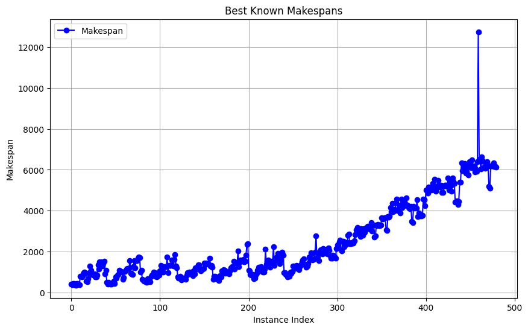
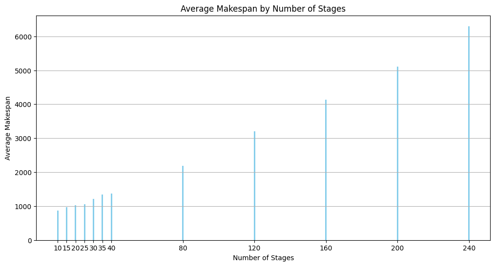
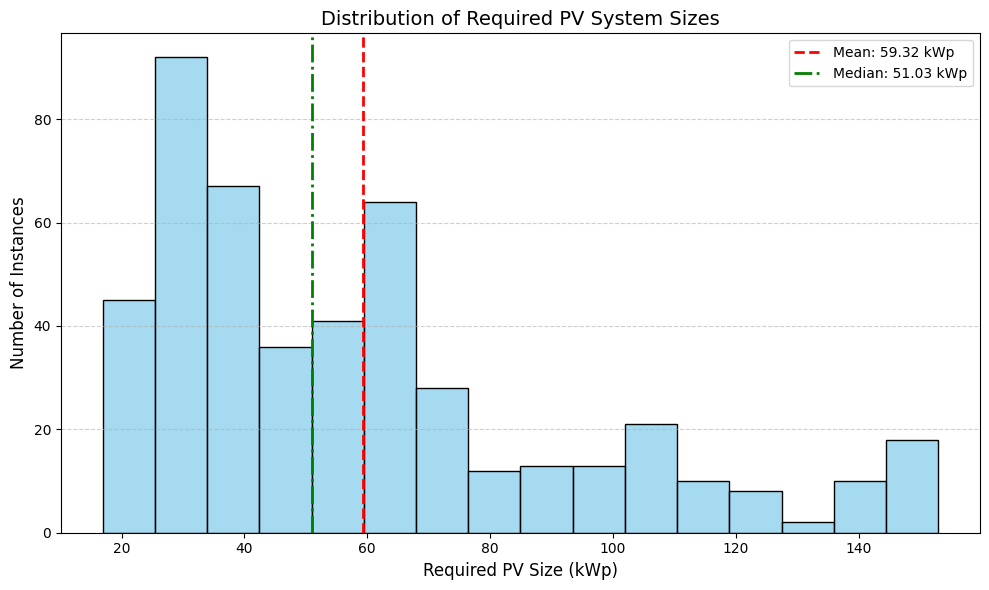
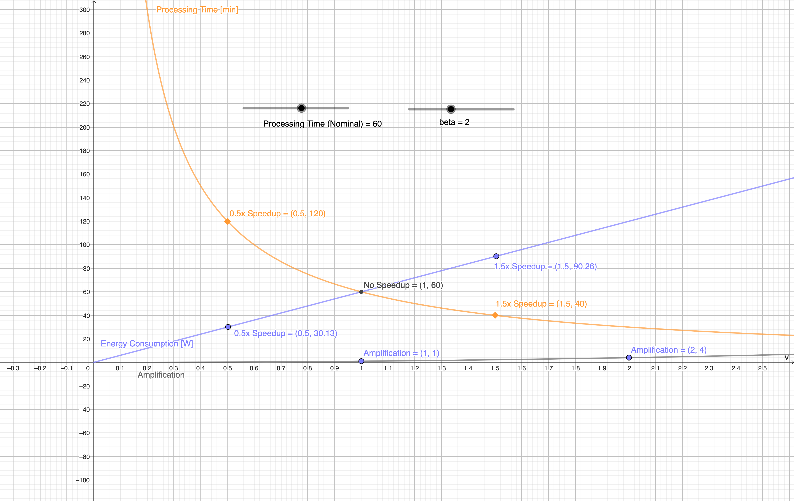
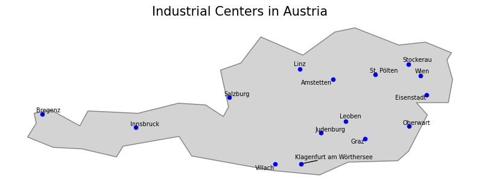
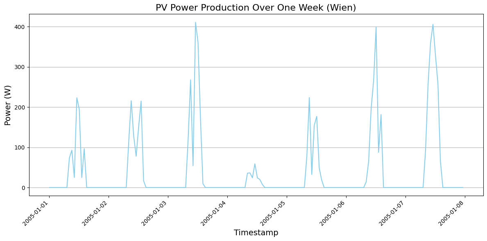

# Energy Aware Production Codebase

This README serves as a **TLDR** for detailed documentation look at the docs and the data package in the release page.

[Data and HTML Documentation](https://github.com/prescriptiveanalytics/hgb-ai-data-energy-aware-production/releases)

The **Energy Aware Scheduling Problem** involves scheduling multiple jobs across multiple stages in a flowshop environment. Each job has a nominal processing time but can be processed at different speeds, impacting both processing time and energy consumption. The main goal is to optimize scheduling while balancing energy efficiency and makespan. The data package also provides PV data from multiple industrial sites in europe, which can be used to define more interesting scenarios. 

## Getting Started
Project is split up into multiple sections: 

- **[Usage]()**: How to use the data for your own optimization algorithm.
- **[Problem Instance Structure]()**: Describes the scheduling problem, its formulation, and the structure of the provided data.
- **[Data Package Structure]()**: Describes the structure of the data package.

You can download the data from the [releases page](https://github.com/prescriptiveanalytics/hgb-ai-data-energy-aware-production/releases).

## Main Contributions

- **Advanced Scheduling Benchmark**:
A comprehensive set of scheduling instances is introduced, where tasks can optionally be accelerated based on configurable speedup parameters. An interactive [GeoGebra explainer](https://www.geogebra.org/classic/cvkz3kq5) is included to visually demonstrate how speedup decisions affect scheduling behavior.

- **Grounded in Literature & Systematically Generated**:
The scheduling problem is based on established formulations from academic literature. Parameterized instance generation enables controlled experimentation across a wide range of problem sizes and configurations.

- **Robust and Portable Data Format**:
A schema.json is provided to support fast, type-safe parsing and validation of instance data across multiple programming environments, improving usability and integration.

- **Transparent Data for Reproducibility**:
All raw instance data is made available to ensure full transparency and reproducibility of experimental results.

- **Realistic Industrial Energy Context**:
Example output data reflects real-world industrial energy use, using locations in Austria selected based on economic relevance (e.g., federal capitals or entries in the Industrie Landkarte).

- **Empirical Parameterization from [MaStr](https://www.marktstammdatenregister.de/MaStR)**:
Real-world solar PV system characteristics (e.g., orientation, tilt, and capacity) are derived from the German MaStr project, specifically filtered for the industrial sector.

- **Reliable Environmental and Economic Inputs**:
Solar generation potential is based on PVGIS data using typical configurations. Electricity pricing reflects real 2024 market values, sourced from APG, enabling accurate cost modeling.

## Pictures

### Scheduling Instances

### PV Coupling

