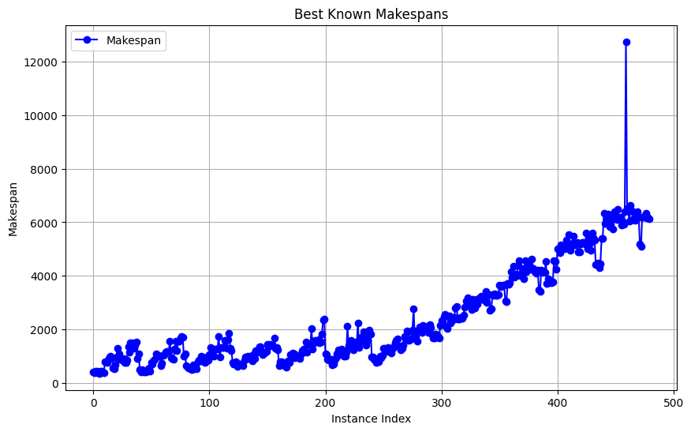
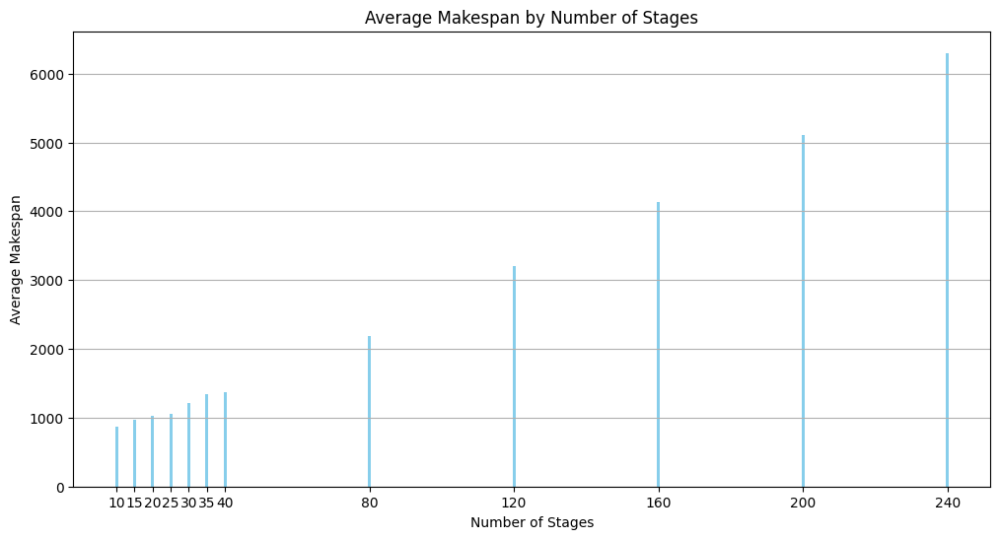
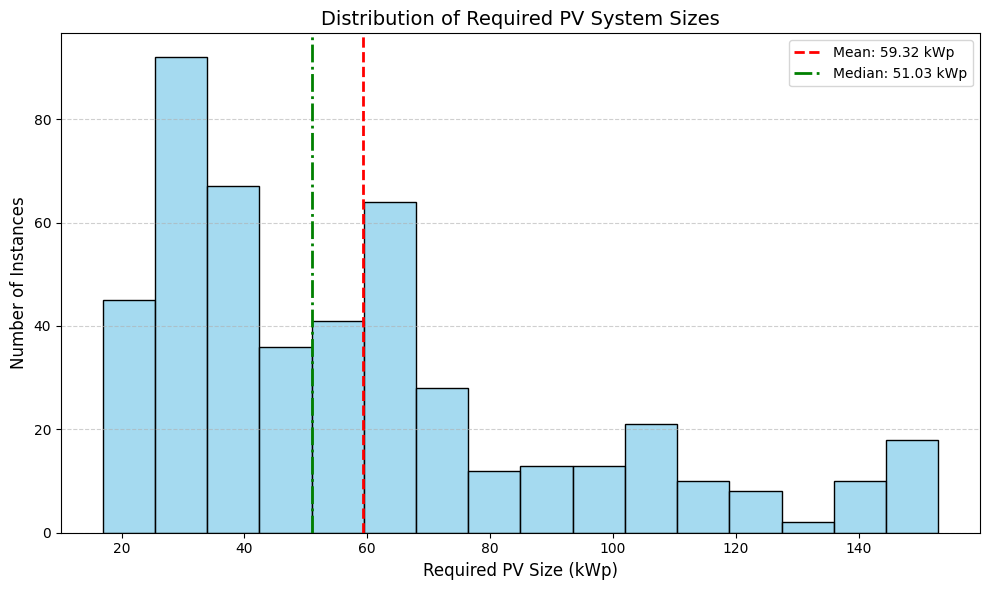
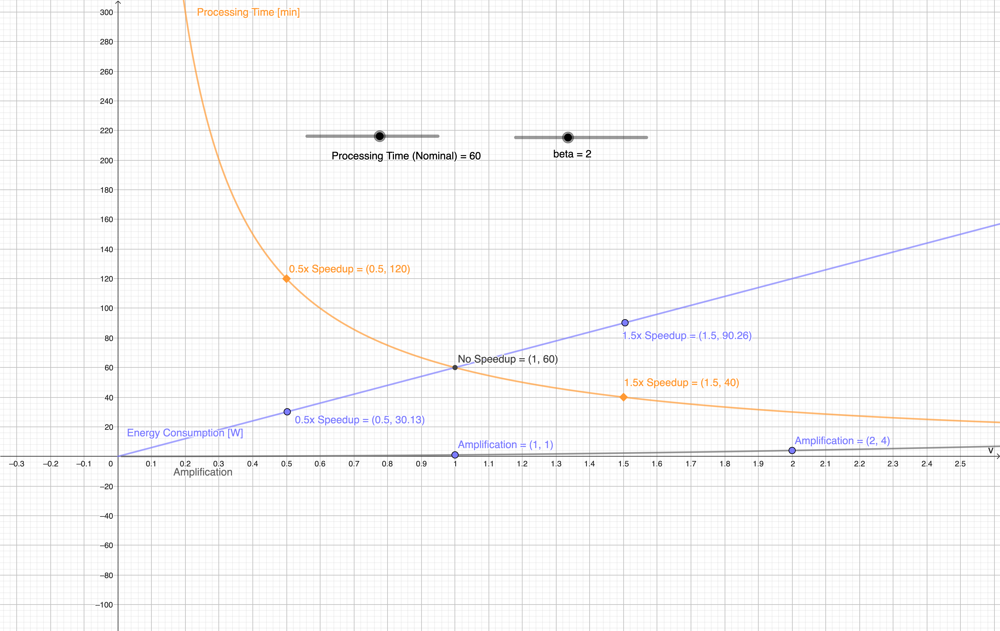
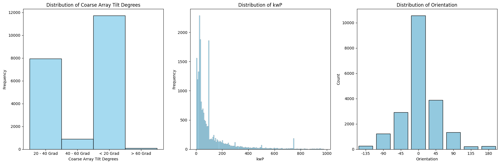
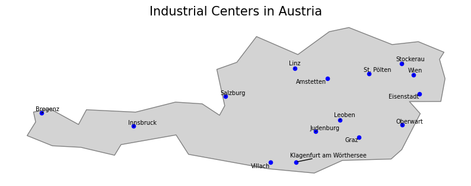
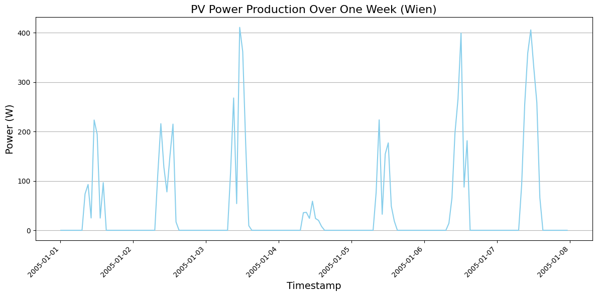
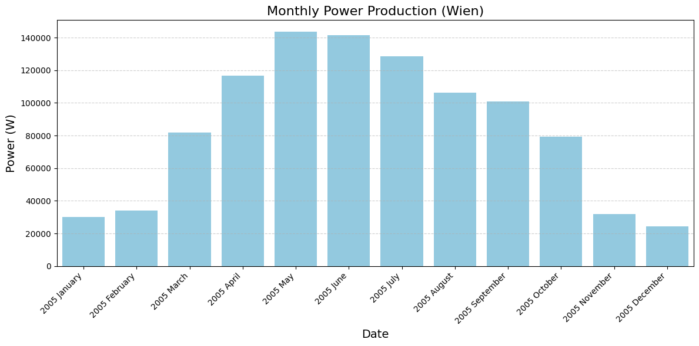
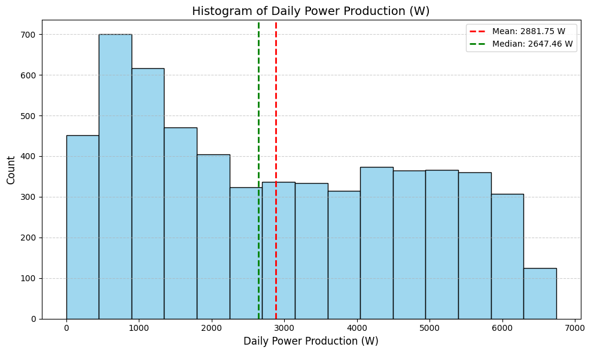

# Data Package Structure

::: energy_aware_production_data.data_package.EnergyAwareSchedulingDataPackage

Note, that the final instances can be found in `self.scheduling_json_instances`. Each instance of the problem provides necessary information about the problem. 

You can download the data from the [releases page](https://github.com/prescriptiveanalytics/hgb-ai-data-energy-aware-production/releases).

## Scheduling

This data packapge provides scheduling problems which includes the possibilities to speed up tasks, at the cost of energy. The best known makespans are obtained without making use of any speedup. The following plots show these makespans:

## Contents

- A set of scheduling instances where each task can optionally benefit from a speedup, depending on selected parameters  
    - Includes an interactive [GeoGebra explainer](https://www.geogebra.org/classic/cvkz3kq5) to help visualize the impact of speedup decisions
- The underlying scheduling problem is based on well-known formulations from academic literature  
    - *(Reference to be added)*
- Parameter configurations used to systematically generate diverse problem instances, enabling controlled experimentation
- A `schema.json` file is provided to facilitate [fast and type-safe](https://quicktype.io) data loading and validation in various programming environments
- Includes the raw, unprocessed instance data for full transparency and reproducibility

### Files and Folders

The following describes the files in the `scheduling` subdirectory.

- `figures/` – A few complementary figures
- `raw_input/instances/*.txt` - Raw input for the scheduling problem in standard format
- `raw_input/best_makespans.txt` - The best makespans for a given instance, found by in the literature.
- `instances/\d_\d_\d.json` – The instances converted to JSON (according to the `schema.json`)
- `instances/parameters.json` – Parameters used to create the instances, used to assign/limit speedup and energy.
- `energy_calculation.json` – A geogebra explainer which provides an interactive plot showing how energy is calculated and how it scales compared to the processing time
- `schema.json` - The json schema. Useful for generating classes for reading the scheduling instances (for example using [quicktype.io](https://quicktype.io/))

## PV

his dataset facilitates the simulation of production processes while concurrently generating energy via photovoltaic (PV) systems. The data was exported on `2025-02-03`.

## Contents

- Example output data from industrial cities in Austria, chosen either as federal capitals or based on the [Industrie Landkarte](https://industrielandkarte.com/).
- Real-world parameter distributions derived from Germany’s MaStr project, specifically filtered for the industrial sector.
- Data sourced from PVGIS, assuming the most common orientation and tilt based on MaStr data, with a default capacity of 1 kwP (scalable manually; the average is approximately 111 kwP).
- Real electricity prices from 2024, sourced from APG.

## Files and Folders

The following describes the contents of the `pv` folder.

- `meta/industrial_cities.csv` – Lists selected cities along with their latitude and longitude.
- `meta/mastr_column_filtered.parquet` – A filtered MaStr dataset with unnecessary columns removed for improved processing speed.
- `meta/industrial_parameter_distribution.csv` – Contains the parameter distribution (kWp, orientation, tilt) with approximately 20,000 rows.
- `meta/mastr_industrial_solar.csv` – Contains the mastr data already filtered for industrial purposes with approximately 20,000 rows.
- `pvgis_data/metadata.json` – Includes file names and parameters used for generating the data via PVGIS.
- `pvgis_data/<CITY>.csv` – Contains PVGIS output data from 2005 to 2020 for each selected city. Ensure the timestamp is parsed correctly, (timezone is local - in this example austria).
- `energy_prices_2024.csv` – Contains energy prices from [APG](https://markt.apg.at/en/transparency/balancing/imbalance-prices/) in austria from 2024.
