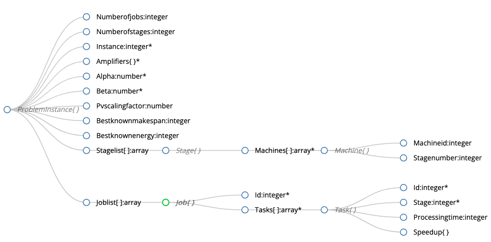

# Problem Instances Structure

Generated using [json-schema-viewer](https://navneethg.github.io/jsonschemaviewer/)

::: energy_aware_production_data.data_package.ProblemInstance
::: energy_aware_production_data.data_package.Stage
::: energy_aware_production_data.data_package.Machine
::: energy_aware_production_data.data_package.Job
::: energy_aware_production_data.data_package.Task

