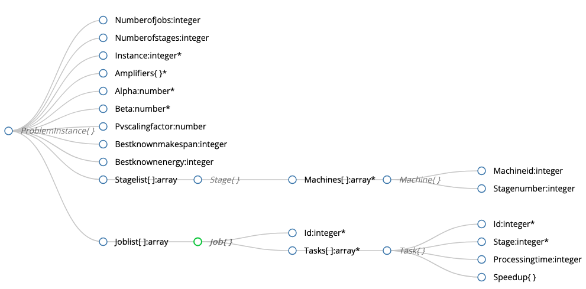

# Usage

The easiest way to access the data is to:

1. Download the data package from [releases page](https://github.com/prescriptiveanalytics/hgb-ai-data-energy-aware-production/releases)
2. Generate data loader classes for your programming language using tools like [quicktype.io](https://quicktype.io/)
3. Get optimizing!

Generated using [json-schema-viewer](https://navneethg.github.io/jsonschemaviewer/)